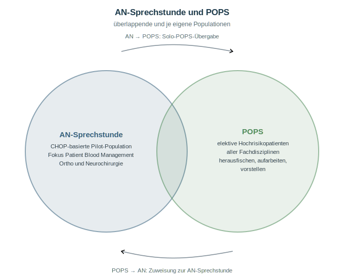
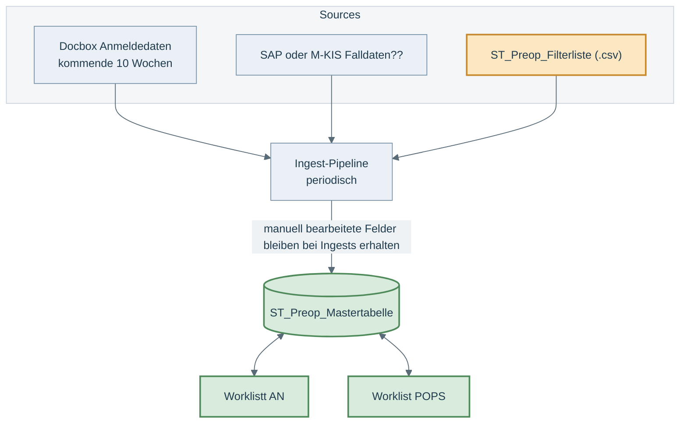

# Spezifikation: Vorläufige Preop Arbeitslisten AN-Sekretariat und POPS

Skizze v0.1 · JE · 16.06.2026

## Vorhaben

- AN-Sekretariat und POPS benötigen bis zur ANA-Cockpit-Implementierung ein vorläufiges Arbeitsmittel, um die Pfade angemeldeter Patienten zu steuern.
- Architektur-Idee: eine gemeinsame Masterliste mit einem Record je FID (oder anderer ID), daraus abgeleitete Sichten und Worklists für beide Teams.
- Die Punkte hier sind Ideen, kein fertiges Konzept. Das Verhalten der Quellsysteme kenne ich nicht. Ziel: wenig Aufwand in die temporäre Lösung, möglichst wenig Overhead.
- Details besser mündlich weiter.

## POPS und Anästhesie: Überlappende und eigenständige Pilotprozesse



## Datenmodell Vorschlag: Eine Filterliste, eine Mastertabelle, zwei Worklists



## ST_Preop_Filterliste
Wird als .csv geliefert. Siehe Appendix. Ingest via Pipeline, wenn möglich.


## ST_Preop_Mastertabelle (Vorschlag)

- Ein Record je FID (o.ä. Identifier).
- `manuell` = nutzerseitig editierbar, bleibt beim Daten-Refresh erhalten.

| feld                        | anzeige        | typ                                     | quelle         | art        | bemerkung                                                    |
| --------------------------- | -------------- | --------------------------------------- | -------------- | ---------- | ------------------------------------------------------------ |
| fid                         | FID            | Text                                    | Docbox / M-KIS | ingest     | Primärschlüssel                                              |
| anmelde_dt                  | Angemeldet     | dd.mm.yyyy                              | Docbox         | ingest     |                                                              |
| angemeldet_seit_d           | Angem. (d)     | Integer                                 | berechnet      | abgeleitet | Kalendertage Anmeldung bis heute                             |
| eingriff_dt                 | Eingriff       | dd.mm.yyyy                              | M-KIS / Docbox | ingest     | M-KIS führend                                                |
| vorlauf_d                   | Vorlauf (d)    | Integer                                 | berechnet      | abgeleitet | Kalendertage heute bis Eingriff                              |
| patient_name                | Name           | Text                                    | Docbox         | ingest     | Personendaten                                                |
| geburtsdatum_dt             | Geburtsdatum   | dd.mm.yyyy                              | Docbox         | ingest     | Personendaten                                                |
| patient_alter               | Alter          | Integer                                 | berechnet      | abgeleitet | Stichtag Eingriffsdatum                                      |
| chop                        | CHOP           | Text                                    | Docbox         | ingest     | Anmelde-CHOP                                                 |
| chop_text                   | CHOP-Text      | Text                                    | Katalog        | abgeleitet | Lookup über chop                                             |
| operateur                   | Operateur      | Text                                    | Docbox         | ingest     |                                                              |
| operateur_bemerkung         | Chir-Bemerkung | Text                                    | Docbox         | ingest     | Keine Ahnung wie das in der Docbox heisst                    |
| operateur_preop_wunsch_flag | Chir-Wunsch    | Boolean                                 | Docbox         | ingest     | wünscht AN-Sprechstunde. Feld aus der Docbox soviel ich weiss |
| an_inklusion                | Inkl.-Grund    | Enum: liste, wunsch_chir, pops_ad_an    | berechnet      | abgeleitet | liste = an_marker_pbm und Alter; wunsch_chir = operateur_preop_wunsch_flag; pops_ad_an = von POPS zugewiesen |
| an_status                   | Status         | Enum: inbox, bearbeitung, erledigt      | Anwender       | manuell    | Default inbox                                                |
| an_pfad                     | Pfad           | Enum: na, an_phys, an_tel, an_phys_pops | Anwender       | manuell    | Default na                                                   |
| an_termin_dt                | Termin         | dd.mm.yyyy                              | Anwender       | manuell    | vorläufiger SS-Termin                                        |
| an_ad_pops_flag             | →POPS          | Boolean                                 | Anwender       | manuell    | AN übergibt als Solo-POPS                                    |
| an_bemerkung                | Bemerkung      | Text                                    | Anwender       | manuell    |                                                              |
| pops_inklusion              | Inkl.-Grund    | Enum: liste, an_solo, an_gemeinsam      | berechnet      | abgeleitet | liste = pops_marker; an_solo = an_ad_pops_flag; an_gemeinsam = an_pfad an_phys_pops |
| pops_status                 | Status         | Enum: inbox, bearbeitung, erledigt      | Anwender       | manuell    | Default inbox                                                |
| pops_pfad                   | Pfad           | Enum: na, pops_phys, pops_tel           | Anwender       | manuell    | Default na, Werte zu definieren                              |
| pops_ad_an_flag             | →AN            | Boolean                                 | Anwender       | manuell    | POPS weist der AN-Sprechstunde zu                            |
| pops_bemerkung              | Bemerkung      | Text                                    | Anwender       | manuell    |                                                              |

Die Teams haben überlappende und jeweils eigene Patientenpopulationen.

Drei Kanäle verbinden die Teams. Von AN zu POPS auf zwei Arten: `an_pfad == an_phys_pops` plant eine gemeinsame Sprechstunde, `an_ad_pops_flag` übergibt den Patienten als Solo-POPS-Prozess. Von POPS zu AN schickt `pops_ad_an_flag` den Patienten in die AN-Sprechstunde. Jedes Team setzt nur seine eigenen Sende-Werte, beim anderen Team erscheinen sie als Aufnahmegrund.

## Worklist AN-Sekretariat

### Funktionen

- Patientenanmeldungen sichten.
- Arbeitsstand festhalten (Status, Bemerkung, vorläufiger Sprechstundentermin).
- Pfad und Bemerkung pflegen.
- dem POPS-Team Patienten zufliessen lassen (`an_ad_pops_flag`).
- Worklist-Volumen steuern über Alter-Cutoff und über `an_marker_pbm` in der ST_Preop_Filterliste.
- Bearbeitung inline in der Worklist oder Absprung auf formularbasiert.

### Aufnahme in die Worklist

Aufnahme, wenn ein Aufnahmegrund zutrifft und der Patient im Vorausschau-Zeitfenster liegt.

Aufnahmegrund, eine Bedingung genügt:

- `an_marker_pbm == TRUE` und `patient_alter >= an_alter_cutoff`
- `operateur_preop_wunsch_flag == TRUE`
- `pops_ad_an_flag == TRUE`

Zeitfenster, immer zusätzlich:

- `an_vorlauf_min <= vorlauf_d <= an_vorlauf_max` (Konfig)

```text
aufnahme_an = ( (an_marker_pbm AND patient_alter >= an_alter_cutoff)
                OR operateur_preop_wunsch_flag
                OR pops_ad_an_flag )
              AND an_vorlauf_min <= vorlauf_d <= an_vorlauf_max
```

### Spalten

fid, anmelde_dt, angemeldet_seit_d, eingriff_dt, vorlauf_d, patient_name, geburts_dt, patient_alter, chop_text, operateur, operateur_bemerkung, an_inklusion, an_status (edit), an_pfad (edit), an_termin_dt (edit), an_ad_pops_flag (edit), an_bemerkung (edit).

### Dynamische Filter und Sortierung

Filter: Alter, Status, Inklusionsgrund, wenn möglich Freitextsuche über Name und Geburtsdatum. Sortierung default Eingriffsdatum aufsteigend.

### Beispielliste

| Eingriff | Vorlauf (d) | Angem. (d) | FID     | Name          | Alter | CHOP-Text                 | Inkl.-Grund | Status      | Pfad    | →POPS | Bemerkung        |
|----------|-------------|------------|---------|---------------|-------|---------------------------|-------------|-------------|---------|-------|------------------|
| 24.06.26 | 8           | 42         | 1234567 | Muster Anna   | 74    | Totalprothese Hüfte       | liste       | bearbeitung | an_phys | FALSE | Anämie-Abklärung |
| 02.07.26 | 16          | 35         | 2345678 | Beispiel Hans | 81    | Dekompression Spinalkanal | liste       | inbox       | na      | TRUE  | an POPS gegeben  |
| 10.07.26 | 24          | 28         | 3456789 | Roth Peter    | 66    | Knie-Totalprothese        | wunsch_chir | inbox       | na      | FALSE | Operateurswunsch |
| 28.08.26 | 73          | 12         | 4567890 | Keller Maria  | 77    | Karotis-Operation         | pops_ad_an  | bearbeitung | an_phys | FALSE | von POPS         |

## Worklist POPS

### Funktionen

- Patientenanmeldungen sichten.
- Arbeitsstand festhalten (Status, Bemerkung).
- Pfad und Bemerkung pflegen.
- dem AN-Team Patienten zufliessen lassen (`pops_ad_an_flag`).
- Worklist-Volumen steuern über `pops_marker` in der ST_Preop_Filterliste.
- Bearbeitung inline in der Worklist oder Absprung auf formularbasiert.

### Aufnahme in die Worklist

Aufnahmegrund, eine Bedingung genügt:

- `pops_marker == TRUE` (liste)
- `an_ad_pops_flag == TRUE` (an_solo, von AN übergeben)
- `an_pfad == an_phys_pops` (an_gemeinsam, gemeinsame Sprechstunde mit AN)

Zeitfenster, immer zusätzlich:

- `pops_vorlauf_min <= vorlauf_d <= pops_vorlauf_max` (Konfig), Fenster mit Mindestvorlauf für die Optimierung

```text
aufnahme_pops = ( pops_marker
                  OR an_ad_pops_flag
                  OR an_pfad == "an_phys_pops" )
                AND pops_vorlauf_min <= vorlauf_d <= pops_vorlauf_max
```

### Spalten

fid, anmelde_dt, angemeldet_seit_d, eingriff_dt, vorlauf_d, patient_name, geburts_dt, patient_alter, chop_text, operateur, operateur_bemerkung, pops_inklusion, an_status, an_termin_dt, pops_status (edit), pops_pfad (edit), pops_ad_an_flag (edit), pops_bemerkung (edit).

### Dynamische Filter und Sortierung

Filter: Alter, Status, Inklusionsgrund, wenn möglich Freitextsuche über Name und Geburtsdatum. Sortierung default Eingriffsdatum aufsteigend.

### Beispielliste

| Eingriff | Vorlauf (d) | Angem. (d) | FID     | Name       | Alter | CHOP-Text             | Inkl.-Grund | Status      | Pfad      | →AN   | Bemerkung                  |
|----------|-------------|------------|---------|------------|-------|-----------------------|-------------|-------------|-----------|-------|----------------------------|
| 15.09.26 | 91          | 21         | 7890123 | Meier Otto | 84    | grosse Leberresektion | liste       | inbox       | na        | FALSE | Optimierung Gerinnung      |
| 18.09.26 | 94          | 30         | 5678901 | Weber Urs  | 79    | Kolonresektion        | liste       | bearbeitung | pops_phys | FALSE | Eisensubstitution          |
| 02.10.26 | 108         | 9          | 6789012 | Frei Lina  | 72    | Aortenklappenersatz   | liste       | inbox       | na        | TRUE  | an AN-Sprechstunde gegeben |

## Persistenz beim Ingest

- Abgleich der eingehenden Records mit dem Bestand über die `fid`.
- `ingest`- und `abgeleitet`-Felder werden aktualisiert.
- Manuelle Felder bleiben erhalten: Status, Pfad, Termin, Flags, Bemerkung.
- Neue `fid` erhält Status `inbox`.
- Weggefallene `fid` wird markiert, nicht still gelöscht.

## Konfigurationsparameter

| Parameter          | Default                  | Wirkung                                                    |
|--------------------|--------------------------|------------------------------------------------------------|
| an_alter_cutoff    | 70                       | Untergrenze für den AN-Aufnahmegrund liste                 |
| an_vorlauf_min     | 0 Tage                   | unterer Cutoff der AN-Worklist, vorlauf_d grösser gleich   |
| an_vorlauf_max     | 80 Tage                  | oberer Cutoff der AN-Worklist, vorlauf_d kleiner gleich    |
| pops_vorlauf_min   | 0 Tage                   | unterer Cutoff der POPS-Worklist, vorlauf_d grösser gleich |
| pops_vorlauf_max   | 120 Tage                 | oberer Cutoff der POPS-Worklist, vorlauf_d kleiner gleich  |
| aktive_filterliste | ST_Preop_Filterliste.csv | markiert aktive CHOPs über an_marker_pbm und pops_marker   |

## Offene Punkte, mündlich weiter

| Nr | Punkt                                                                          |
|----|--------------------------------------------------------------------------------|
| 1  | pops_pfad-Werte noch definieren                                                |
| 2  | vorlauf_d in Kalendertagen oder Arbeitstagen?                                  |
| 3  | Verhalten der Quellsysteme Docbox und M-KIS, Integrationsweg und Frequenz      |
| 4  | Mehrbenutzerbetrieb und Sperren bei gleichzeitiger Bearbeitung?                |
| 5  | Aufwand bezogen auf eine Intermediärlösung oder lieber Minimal Viable Product? |

## Weitere hilsreiche Features

- Userseitiger Export der aktuellen Master_liste als csv für Audit und Analytics.

## Anhang: ST_Preop_Filterliste (CSV-Ingest)

UTF-8, Trennzeichen Semikolon, Kopfzeile, eine Zeile je CHOP-Code. Markiert, welche CHOPs für AN und für POPS aktiv sind.

| spalte        | typ     | beschreibung                        |
|---------------|---------|-------------------------------------|
| chop          | Text    | CHOP-Code, Schlüssel                |
| an_marker_pbm | Boolean | TRUE = aktiv für die AN-Schiene PBM |
| pops_marker   | Boolean | TRUE = aktiv für POPS               |
| chop_text     | Text    | Klartext                            |

Beispiel Daten Head:
```csv
chop;an_marker_pbm;pops_marker;chop_text
81.51.00;TRUE;FALSE;Totalprothese Hüftgelenk
03.09.10;FALSE;TRUE;Dekompression Spinalkanal
```
